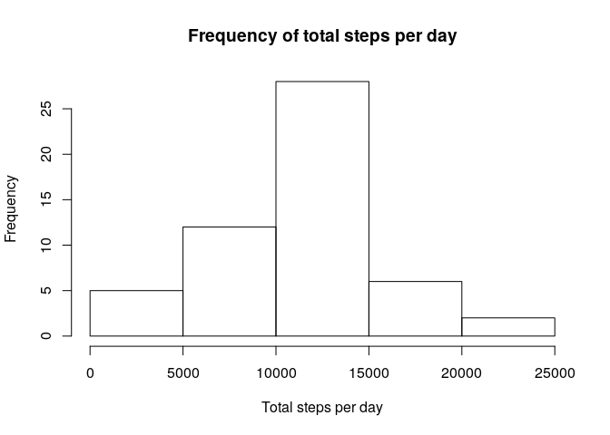
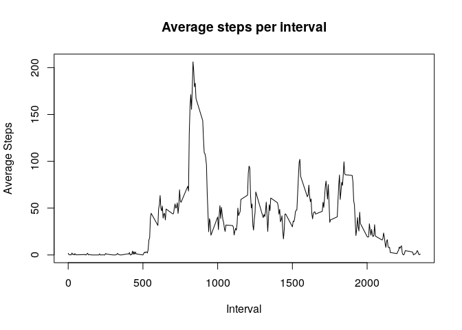
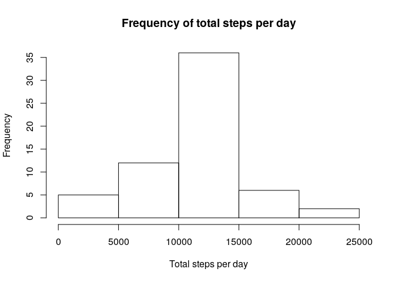
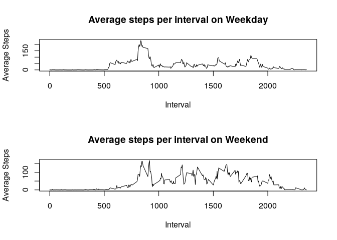

# Course Project 1


## Course Project 1: Reproducible Research

This document will contain the code and thinking behind analyzing the data presented in the first course project for the Reproducible Research Coursera course.

## Loading and Inputting the Data

First we load the data, I have assumed your working directory contains the file. I then change the date column from a factor to a date object for ease of use later in analysis.


```r
activity <- read.csv("activity.csv")
activity$date <- strptime(activity$date, format = '%Y-%m-%d')
```

## Mean total number of steps, ignoring NA's

We will now create a histogram of the total number of steps per day for any particular date, and then the mean and median of those steps. Using the aggregate function and temporarily turning the dates back into factors, I can get a table of dates with their respective total step counts. Then I create a histogram using the base plotting system. After generating that, we just use the mean and median functions. 


```r
stepstotalna <- aggregate(activity$steps,by=list(substr(activity$date,1,10)), FUN = sum)
hist(stepstotalna$x, xlab = "Total steps per day", main ="Frequency of total steps per day")
```

<!-- -->

```r
mean(stepstotalna$x, na.rm=TRUE)
```

```
## [1] 10766.19
```

```r
median(stepstotalna$x, na.rm=TRUE)
```

```
## [1] 10765
```

## Average Daily Activity Pattern

The average daily activity pattern will be found in a similar manner as the mean per day. We will use the aggregate function to generate a table that averages the amount of steps per interval across all days (per assignment instructions), ignoring NA's. We can then plot that table, as average steps over the day. Being discrete chunks, the plot is fairly jagged, but can easily show the most activity lies between 500 and 1000 minutes. As an exploratory graph, this jaggedeness is fine, but some smoothing may be necessary to present to others. Finding the maximum value, we just extract the max value and find which interval it corresponds too, which turns out to be 835.


```r
avgactivity <- aggregate(activity$steps, by=list(activity$interval), FUN = mean, na.rm=TRUE)
plot(avgactivity, type="l", main = "Average steps per interval", xlab= "Interval", ylab = "Average Steps")
```

<!-- -->

```r
avgactivity$Group.1[which(max(avgactivity$x)==avgactivity$x)]
```

```
## [1] 835
```

## Missing Values

First we want to see how many missing values we actually have


```r
length(activity$steps)-sum(complete.cases(activity$steps))
```

```
## [1] 2304
```

Replacing the missing values, if we look at the data that is missing, seems to be missing either for whole days or at least the majority of the day.


```r
head(which(complete.cases(activity$steps)==FALSE),300)
```

```
##   [1]    1    2    3    4    5    6    7    8    9   10   11   12   13   14
##  [15]   15   16   17   18   19   20   21   22   23   24   25   26   27   28
##  [29]   29   30   31   32   33   34   35   36   37   38   39   40   41   42
##  [43]   43   44   45   46   47   48   49   50   51   52   53   54   55   56
##  [57]   57   58   59   60   61   62   63   64   65   66   67   68   69   70
##  [71]   71   72   73   74   75   76   77   78   79   80   81   82   83   84
##  [85]   85   86   87   88   89   90   91   92   93   94   95   96   97   98
##  [99]   99  100  101  102  103  104  105  106  107  108  109  110  111  112
## [113]  113  114  115  116  117  118  119  120  121  122  123  124  125  126
## [127]  127  128  129  130  131  132  133  134  135  136  137  138  139  140
## [141]  141  142  143  144  145  146  147  148  149  150  151  152  153  154
## [155]  155  156  157  158  159  160  161  162  163  164  165  166  167  168
## [169]  169  170  171  172  173  174  175  176  177  178  179  180  181  182
## [183]  183  184  185  186  187  188  189  190  191  192  193  194  195  196
## [197]  197  198  199  200  201  202  203  204  205  206  207  208  209  210
## [211]  211  212  213  214  215  216  217  218  219  220  221  222  223  224
## [225]  225  226  227  228  229  230  231  232  233  234  235  236  237  238
## [239]  239  240  241  242  243  244  245  246  247  248  249  250  251  252
## [253]  253  254  255  256  257  258  259  260  261  262  263  264  265  266
## [267]  267  268  269  270  271  272  273  274  275  276  277  278  279  280
## [281]  281  282  283  284  285  286  287  288 2017 2018 2019 2020 2021 2022
## [295] 2023 2024 2025 2026 2027 2028
```
Though I've cut it off for this document, you may look at the whole list for your own review to see that these are large sequences of numbers and not just a certain interval each day or seemingly random missing observations. Based upon that, the best option for replacing that data would be to use the mean for each five minute interval in place of the NA's. We construct a new data frame below that has those values replacing the NA's, using the same table we have already constructed for the average daily activity pattern. 


```r
rows <- which(complete.cases(activity$steps) == FALSE)
avginterval <- rep(avgactivity$x, times=length(rows)/length(avgactivity$x))
fullactivity <- activity
fullactivity$steps[rows] <- avginterval
stepstotal<- aggregate(fullactivity$steps,by=list(substr(fullactivity$date,1,10)), FUN = sum)
hist(stepstotal$x, xlab = "Total steps per day", main ="Frequency of total steps per day")
```

<!-- -->

```r
mean(stepstotal$x)
```

```
## [1] 10766.19
```

```r
median(stepstotal$x)
```

```
## [1] 10766.19
```

## Looking at these results

As expected by using average data, it tended to pull the data closer to the average. This is especially clear from the mean and median being equal not only to each other but also to the previous mean. 

The differences between which method you use to replace the missing values will result in different changes to the data. Replacing the way I did, as I stated above, clearly makes the numbers regress closer to the mean. 

## Does day of the week affect activity?

We want to see if the fact that it is either a weekday or weekend affects the amount of steps made at any given interval. 

First, we want to add to our new data frame whether or not the day was a weekday or a weekend. We'll do this using a handy default package named "chron" and it's "is.weekend" function.


```r
library(chron)
fullactivity$day <- ifelse(is.weekend(fullactivity$date), "weekend", "weekday")
```

Now to create the exploratory graphs.


```r
weekdayactivity <- subset(fullactivity, subset= (fullactivity$day == "weekday"))
weekendactivity <- subset(fullactivity, subset= (fullactivity$day == "weekend"))
avgweekdayactivity <- aggregate(weekdayactivity$steps, by=list(weekdayactivity$interval), FUN = mean)
avgweekendactivity <- aggregate(weekendactivity$steps, by=list(weekendactivity$interval), FUN = mean)
par(mfrow=c(2,1))
plot(avgweekdayactivity, type="l", main = "Average steps per interval on Weekday", xlab= "Interval", ylab = "Average Steps")
plot(avgweekendactivity, type="l", main = "Average steps per interval on Weekend", xlab= "Interval", ylab = "Average Steps")
```

<!-- -->
